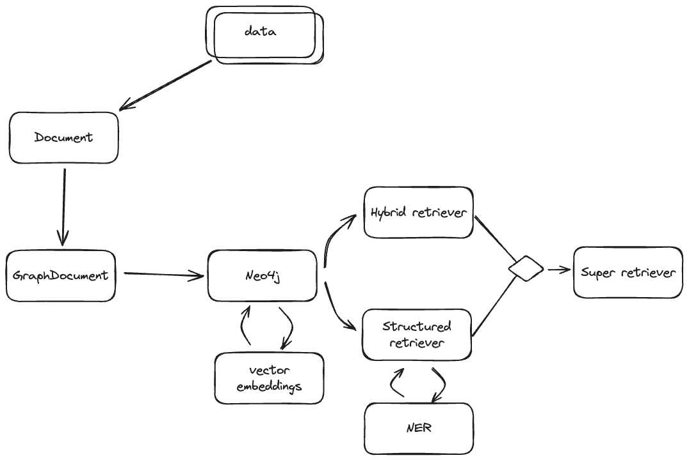

# gRAG

This project was inspired by recent work done in the area of utilizing knowledge graphs to enhance retrieval.

In this project you'll find an ingestion pipeline that streamline getting data from any type of file containing text and parsing it into a Neo4j knowledge graph E2E.

And there is also the knowledge graph RAG implementation and a `fastAPI` application that serves this content. So far we're mounting a `chainlit` chat application for testing, but adding chains as individual endpoints is planned.

I went more in-depth about things over at my blog, if you want to know more, check out:

- [intro](https://www.mattjh.sh/post/grag-intro/)
- [ingestion](https://www.mattjh.sh/post/grag-ingestion/)
- [app](https://www.mattjh.sh/post/grag-app/)

## Data ingest breakdown

The ingestion is done in multiple steps:

- Parse file contents using `tika`
- Split `Document` using a semantic splitting strategy
- Use LLM to create `GraphDocuments` from sequence of `Documents`
- Save `GraphDocuments` to a running `Neo4j` instance
- Use the created graph, and the corresponding source document nodes to create vector/keyword indices in the graph.

## Knowledge graph RAG

This RAG setup is based around two retrievers, `hybrid` and `structured`, we combine the results of these retrievers.

The `structured` retriever relies of extracting entities from a given query, we achieve this via a specialized `NER` chain that return a `list` of names. With this list of names we execute cypher that returns `nodes` and `relationships` in a way easily interpreted by `LLMs`.

The `hybrid` retriever is a whole lot simpler, when creating the graph database we lay out the groundwork needed to also create vector embeddings and keyword index. Embeddings are stored on source document nodes which we then can search by cosine similarity.

### References

[One of many inspiring blog posts at Neo4j developer blogs](https://neo4j.com/developer-blog/global-graphrag-neo4j-langchain/)

[From Local to Global: A Graph RAG Approach to Query-Focused Summarization](https://arxiv.org/abs/2404.16130)
